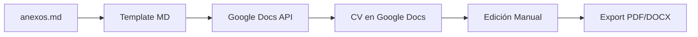

# 📋 Análisis y Simplificación del CV Suite - Hacia Google Docs

## 🎯 Problema Identificado

### **Situación Actual**
El repositorio ha evolucionado hacia un sistema **excesivamente complejo** con:
- ✅ 5 generadores diferentes (HTML, Compact, Markdown, LaTeX, ReportLab)
- ✅ Arquitectura modular robusta
- ❌ **Complejidad innecesaria** para el objetivo real
- ❌ **Múltiples opciones** que generan confusión
- ❌ **Mantenimiento complejo** de 5 sistemas diferentes

### **Objetivo Real del Usuario**
- 🎯 **Un CV simple y profesional**
- 🎯 **Fácil de editar y mantener**
- 🎯 **Siguiendo mejores prácticas de CV 2025**
- 🎯 **Workflow práctico** para uso cotidiano

---

## 🔍 Análisis de la Propuesta: Markdown → Google Docs

### **✅ Ventajas de la Estrategia Markdown + Google Docs**

#### **1. Simplicidad Extrema**
- **Fuente única**: Markdown como single source of truth
- **Edición visual**: Google Docs para ajustes finales
- **Sin dependencias**: No requiere LaTeX, ReportLab, weasyprint
- **Versionado simple**: Git para Markdown, Google Drive para versiones finales

#### **2. Workflow Profesional**


#### **3. Beneficios Reales**
- 🎨 **Control visual**: Editor WYSIWYG de Google Docs
- 🔄 **Colaboración**: Comentarios y sugerencias
- 📱 **Acceso móvil**: Editar desde cualquier dispositivo
- 💾 **Backup automático**: Google Drive
- 📤 **Export múltiple**: PDF, DOCX, Link compartible
- 🎯 **ATS-friendly**: Google Docs genera HTML/PDF limpio

### **❌ Desventajas y Consideraciones**

#### **1. Limitaciones Técnicas**
- **API de Google Docs**: Requiere autenticación OAuth
- **Formato limitado**: Menos control que HTML/CSS
- **Dependencia externa**: Requiere cuenta Google
- **Rate limits**: Limitaciones de API

#### **2. Pérdida de Funcionalidades**
- **Sistema de colores inteligente**: Se simplifica
- **Personalización automática**: Se reduce
- **Templates múltiples**: Se unifica

---

## 🎯 Propuesta de Solución Simplificada

### **Arquitectura Propuesta**

```
cv-simple/
├── 📊 cv-data.md                   # Datos personales (reemplaza anexos.md)
├── 🎨 cv-template.md               # Template base profesional
├── 🚀 generate-cv.py               # Script único y simple
├── 📁 output/                      # CVs generados
│   ├── cv-base.md                 # Markdown generado
│   ├── cv-google-docs-id.txt      # ID del documento en Google Docs
│   └── cv-final.pdf               # Export final
└── 📚 docs/
    ├── setup-google-api.md        # Configuración Google Docs API
    └── cv-best-practices.md       # Mejores prácticas CV 2025
```

### **Funcionalidades Core**

#### **1. Generador Simple (generate-cv.py)**
```python
def generate_cv():
    """Pipeline simplificado"""
    # 1. Leer datos personales
    data = parse_cv_data('cv-data.md')
    
    # 2. Aplicar template profesional
    cv_markdown = apply_template(data, 'cv-template.md')
    
    # 3. Crear documento en Google Docs
    doc_id = create_google_doc(cv_markdown)
    
    # 4. Aplicar formato profesional
    format_document(doc_id)
    
    # 5. Exportar PDF
    export_pdf(doc_id, 'output/cv-final.pdf')
    
    return doc_id
```

#### **2. Template Profesional Único**
- **Estructura ATS-optimizada**
- **Diseño minimalista moderno**
- **Siguiendo mejores prácticas 2025**
- **Fácil personalización**

#### **3. Mejores Prácticas Integradas**
- ✅ **Secciones estándar**: Contacto, Resumen, Experiencia, Educación, Skills
- ✅ **Formato ATS-friendly**: Estructura clara y legible
- ✅ **Longitud óptima**: 1-2 páginas máximo
- ✅ **Keywords relevantes**: Basadas en industria
- ✅ **Tipografía profesional**: Google Fonts estándar

---

## 🚀 Plan de Implementación

### **Fase 1: Simplificación (Semana 1)**

#### **Día 1-2: Análisis y Diseño**
- [ ] Analizar código actual y extraer lo esencial
- [ ] Diseñar template único profesional
- [ ] Definir estructura de datos simplificada

#### **Día 3-4: Implementación Core**
- [ ] Crear `cv-data.md` con estructura optimizada
- [ ] Desarrollar `cv-template.md` siguiendo mejores prácticas
- [ ] Implementar `generate-cv.py` básico (sin Google API)

#### **Día 5-7: Validación Local**
- [ ] Generar CV en Markdown
- [ ] Validar formato y contenido
- [ ] Ajustar template según feedback

### **Fase 2: Integración Google Docs (Semana 2)**

#### **Día 1-3: Setup Google API**
- [ ] Configurar proyecto en Google Cloud Console
- [ ] Implementar autenticación OAuth
- [ ] Crear funciones básicas de Google Docs API

#### **Día 4-5: Generación Automática**
- [ ] Implementar creación de documento
- [ ] Aplicar formato profesional automático
- [ ] Configurar export a PDF

#### **Día 6-7: Testing y Refinamiento**
- [ ] Probar workflow completo
- [ ] Ajustar formato y estilos
- [ ] Documentar proceso

### **Fase 3: Optimización (Semana 3)**

#### **Mejoras del Template**
- [ ] Optimizar para ATS
- [ ] Validar con herramientas de parsing
- [ ] Ajustar spacing y tipografía

#### **Automatización**
- [ ] Script de configuración inicial
- [ ] Validación de datos
- [ ] Manejo de errores

---

## 🎨 Template Profesional Propuesto

### **Estructura del CV**

```markdown
# [NOMBRE COMPLETO]
**[Título Profesional]** | [Ciudad, País] | [Email] | [Teléfono] | [LinkedIn]

---

## RESUMEN PROFESIONAL
[2-3 líneas describiendo experiencia y valor agregado]

## EXPERIENCIA PROFESIONAL

### [Empresa] - [Posición]
**[Período]** | [Ubicación]
- [Logro cuantificable 1]
- [Logro cuantificable 2]
- [Logro cuantificable 3]

## EDUCACIÓN
**[Título]** | [Universidad] | [Año]

## HABILIDADES TÉCNICAS
**Lenguajes:** [Lista]
**Frameworks:** [Lista]  
**Tools:** [Lista]

## CERTIFICACIONES
- [Certificación 1] | [Año]
- [Certificación 2] | [Año]
```

### **Características del Template**

#### **✅ ATS-Optimizado**
- Headers con formato estándar
- Bullets simples (-)
- Sin tablas complejas
- Keywords relevantes por industria

#### **✅ Moderno y Limpio**
- Tipografía: Google Sans / Arial
- Espaciado profesional
- Jerarquía visual clara
- Longitud: 1 página óptima

#### **✅ Personalizable**
- Variables por industria
- Secciones opcionales
- Keywords automáticas
- Logros cuantificables

---

## 💡 Beneficios de la Simplificación

### **Para el Desarrollador**
- 🔧 **Mantenimiento simple**: Un solo script vs 5 generadores
- 🎯 **Objetivo claro**: CV profesional, no showcase tecnológico  
- 📚 **Documentación mínima**: Fácil de entender y usar
- 🚀 **Deploy rápido**: Setup en minutos, no horas

### **Para el Usuario Final**
- ✅ **Workflow intuitivo**: Editar Markdown → Google Docs → PDF
- 🎨 **Control visual**: Editor familiar de Google Docs
- 📱 **Acceso universal**: Desde cualquier dispositivo
- 🔄 **Iteración rápida**: Cambios en tiempo real

### **Para Reclutadores/ATS**
- 📄 **Formato estándar**: PDF limpio y parseable
- 🎯 **Estructura predecible**: Secciones estándar
- 🔍 **Keywords optimizadas**: Mejor ranking ATS
- 📊 **Legibilidad alta**: Diseño profesional

---

## 🚧 Migración desde Sistema Actual

### **Qué Conservar**
- ✅ **Datos personales**: `anexos.md` → `cv-data.md`
- ✅ **Mejores prácticas**: Conocimiento de ATS optimization
- ✅ **Sistema de colores**: Simplificado a 2-3 opciones
- ✅ **Estructura modular**: Mantenida pero simplificada

### **Qué Eliminar**
- ❌ **Múltiples generadores**: HTML, LaTeX, ReportLab
- ❌ **Complejidad arquitectural**: Registry pattern, inheritance
- ❌ **Dependencies pesadas**: weasyprint, reportlab, texlive
- ❌ **CLI compleja**: Múltiples comandos y opciones

### **Plan de Transición**
```bash
# 1. Crear nuevo directorio
mkdir cv-simple
cd cv-simple

# 2. Migrar datos esenciales
cp ../anexos.md cv-data.md

# 3. Implementar generador simple
# [Desarrollo del nuevo sistema]

# 4. Validar resultados
python generate-cv.py

# 5. Comparar con sistema anterior
# [Testing y feedback]

# 6. Deprecar sistema complejo
mv ../src ../src-legacy
```

---

## 🎯 Recomendación Final

### **✅ Proceder con Simplificación**

**Justificación:**
1. **Objetivo real**: El usuario necesita UN CV profesional, no múltiples opciones
2. **Mantenimiento**: Un sistema simple es más sostenible
3. **Usabilidad**: Google Docs es familiar y accesible
4. **Profesionalismo**: PDF generado por Google Docs es ATS-friendly
5. **Futuro-proof**: Menos dependencias = menos problemas

### **🚀 Próximos Pasos Inmediatos**

1. **Validar propuesta** con stakeholder
2. **Crear prototipo** del template en Markdown
3. **Investigar Google Docs API** y limitaciones
4. **Definir criterios de éxito** para migración
5. **Planificar timeline** realista

---

## 📊 Comparación: Sistema Actual vs Propuesto

| Aspecto | Sistema Actual | Sistema Propuesto |
|---------|----------------|-------------------|
| **Complejidad** | 5 generadores | 1 generador |
| **Líneas de código** | ~3000+ líneas | ~300 líneas |
| **Dependencias** | 10+ paquetes | 2 paquetes |
| **Tiempo setup** | 30+ minutos | 5 minutos |
| **Mantenimiento** | Alto | Bajo |
| **Usabilidad** | Técnica | Intuitiva |
| **Output quality** | Variable | Consistente |
| **ATS compatibility** | Variable | Optimizado |

---

**💡 Conclusión:** La simplificación hacia Markdown + Google Docs API alinea perfectamente con el objetivo real: crear CVs profesionales de manera simple y eficiente, sin sacrificar calidad.